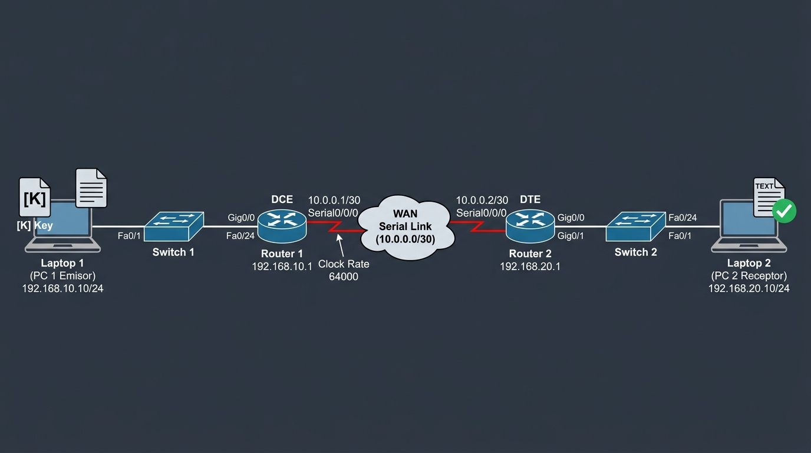

# Documento Técnico de Arquitectura: Red WAN y Sistema Criptográfico

**Materia:** Administración y Seguridad de Redes  
**Proyecto:** Interconexión de Redes de Área Local sobre Enlace WAN Serial con Cifrado Clásico (César, Vigenère y Vernam)  
**Entorno de Operación:** Equipos Físicos Reales (2 Laptops, 2 Routers Cisco, 2 Switches Cisco Catalyst, Cable Serial V.35 DCE/DTE)

---

## 1. Resumen Ejecutivo del Proyecto

El presente proyecto integra los dos pilares fundamentales de la infraestructura de tecnologías de la información:
1. **Comunicaciones y Redes (Networking):** El diseño, segmentación IP, cableado estructurado, conmutación en Capa 2 y enrutamiento en Capa 3 para comunicar dos redes locales independientes (LAN 1 y LAN 2) a través de un enlace punto a punto WAN serial que emula la "nube" de transporte de telecomunicaciones.
2. **Seguridad de la Información (Ciberseguridad):** La protección de la confidencialidad de los datos en tránsito. La información originada en la **Laptop 1** es cifrada matemáticamente antes de abandonar el host de origen, viaja a través de todos los dispositivos de la topología en texto cifrado (*ciphertext*), impidiendo que un tercero que intercepte el tráfico en la red pueda leerlo, y finalmente es recibida y descifrada en la **Laptop 2**, donde se exporta como archivo `.txt` verificado.

---

## 2. Topología de Red y Arquitectura Física

### 2.1 Diagrama de Conexión de Extremo a Extremo



```
┌─────────────────┐                                                                                             ┌─────────────────┐
│    LAPTOP 1     │                                                                                             │    LAPTOP 2     │
│   (PC 1 Emisor) │                                                                                             │ (PC 2 Receptor) │
│  192.168.10.10  │                                                                                             │ 192.168.20.10   │
└────────┬────────┘                                                                                             └────────▲────────┘
         │ Cable RJ-45 (Directo)                                                                                         │ Cable RJ-45 (Directo)
         ▼                                                                                                               │
┌─────────────────┐                                                                                             ┌────────┴────────┐
│    SWITCH 1     │                                                                                             │    SWITCH 2     │
│ (Catalyst 2960) │                                                                                             │ (Catalyst 2960) │
└────────┬────────┘                                                                                             └────────▲────────┘
         │ Cable RJ-45 (Uplink)                                                                                          │ Cable RJ-45 (Downlink)
         ▼                                                                                                               │
┌─────────────────┐                       CABLE SERIAL V.35 / SMART SERIAL                       ┌────────┴────────┐
│    ROUTER 1     │                       ════════════════════════════════                       │    ROUTER 2     │
│  (Cisco 1941)   │═════════════════════► [ EXTREMO DCE ]       [ EXTREMO DTE ] ════════════════►│  (Cisco 1941)   │
│ LAN:192.168.10.1│   Puerto Serial 0/0/0   (Clock Rate: 64000)   Puerto Serial 0/0/0            │ LAN:192.168.20.1│
│ WAN: 10.0.0.1   │                                                                              │ WAN: 10.0.0.2   │
└─────────────────┘                       ◄─────── LA NUBE WAN DE TRANSPORTE ───────►            └─────────────────┘
```

---

### 2.2 Tabla de Direccionamiento IP y Segmentación (VLSM)

Se definieron **tres dominios de difusión (broadcast) independientes**:

| Segmento de Red | Dirección de Red | Máscara | Rango de IPs Útiles | Propósito |
| :--- | :--- | :--- | :--- | :--- |
| **LAN 1** | `192.168.10.0` | `255.255.255.0` (`/24`) | `192.168.10.1` - `192.168.10.254` | Red local del Emisor (Laptop 1, Switch 1, Router 1) |
| **WAN (Nube)** | `10.0.0.0` | `255.255.255.252` (`/30`) | `10.0.0.1` - `10.0.0.2` | Enlace punto a punto serial entre Router 1 y Router 2 |
| **LAN 2** | `192.168.20.0` | `255.255.255.0` (`/24`) | `192.168.20.1` - `192.168.20.254` | Red local del Receptor (Laptop 2, Switch 2, Router 2) |

#### Asignación de Interfaces y Dispositivos:
- **Laptop 1:** IP `192.168.10.10`, Máscara `255.255.255.0`, Gateway `192.168.10.1`.
- **Router 1 (R1):**
  - Interfaz LAN `GigabitEthernet0/0`: `192.168.10.1 /24` (Puerta de enlace de Laptop 1).
  - Interfaz WAN `Serial0/0/0`: `10.0.0.1 /30` (Lado DCE del cable serial con `clock rate 64000`).
- **Router 2 (R2):**
  - Interfaz WAN `Serial0/0/0`: `10.0.0.2 /30` (Lado DTE del cable serial).
  - Interfaz LAN `GigabitEthernet0/0`: `192.168.20.1 /24` (Puerta de enlace de Laptop 2).
- **Laptop 2:** IP `192.168.20.10`, Máscara `255.255.255.0`, Gateway `192.168.20.1`.

---

## 3. Fundamento de Redes: ¿Cómo Funciona la Conexión?

### 3.1 ¿Por qué el Cable Serial representa la "Nube"?
En las redes comerciales, las empresas no tiran un cable de miles de kilómetros entre dos ciudades; contratan a un proveedor de servicios de telecomunicaciones (ISP o Carrier). Ese proveedor entrega un circuito de datos síncrono.  
En el laboratorio físico:
- **No existe una nube física:** La nube se emula conectando los dos routers espalda con espalda (*back-to-back*) mediante un **cable serial V.35 o Smart Serial**.
- **El concepto de DCE y DTE:**
  - **DCE (Data Communications Equipment):** Representa el equipo de la compañía telefónica/ISP (el módem o CSU/DSU). Es el encargado de marcar el ritmo de transmisión. Por esta razón, el router con el extremo DCE **debe llevar obligatoriamente** el comando `clock rate 64000` (64 kbps).
  - **DTE (Data Terminal Equipment):** Representa el equipo del cliente (el router receptor). Este extremo simplemente se sincroniza con los pulsos de reloj que le envía el DCE.

### 3.2 ¿Por qué se usa la máscara `/30` (`255.255.255.252`) en la WAN?
Una máscara `/30` deja únicamente 2 bits para host ($2^2 - 2 = 2$ direcciones utilizables). En un enlace serial punto a punto únicamente existen dos extremos (R1 y R2). Usar `/30` es la mejor práctica de ingeniería de redes porque evita el desperdicio de direcciones IP públicas o privadas.

### 3.3 Conmutación en Capa 2 (Switches Catalyst 2960)
Los switches operan en la **Capa de Enlace de Datos**. Su función es:
- Aprender las direcciones MAC de los dispositivos conectados inspeccionando las tramas Ethernet entrantes.
- Conmutar los paquetes a nivel local sin alterar la dirección IP de origen ni de destino.
- Conectar la laptop a su router mediante un puerto de acceso de alta velocidad (100 Mbps / 1 Gbps).

### 3.4 Enrutamiento en Capa 3 (Routers Cisco y Rutas Estáticas)
Los routers operan en la **Capa de Red**. Su función principal es determinar la mejor ruta para enviar paquetes entre redes lógicas distintas.
- Cuando Laptop 1 (`192.168.10.10`) quiere enviar datos a Laptop 2 (`192.168.20.10`), se da cuenta de que la IP de destino **no pertenece a su red local**.
- Por ende, Laptop 1 envía el paquete a su **Puerta de Enlace Predeterminada (Default Gateway: `192.168.10.1`)**.
- Router 1 recibe el paquete en su interfaz `Gig0/0`, lee la IP de destino (`192.168.20.10`), busca en su tabla de enrutamiento y encuentra la regla que configuramos:
  ```ios
  ip route 192.168.20.0 255.255.255.0 10.0.0.2
  ```
- Esta regla le dice: *"Cualquier paquete que vaya hacia la red 192.168.20.0, sácalo a través del enlace serial hacia el siguiente salto: 10.0.0.2 (Router 2)"*.
- Router 2 recibe el paquete por su interfaz serial, consulta su tabla local, ve que la red `192.168.20.0/24` está directamente conectada a su puerto `Gig0/0` y se lo entrega a la Laptop 2.

---

## 4. Fundamento Criptográfico: Los Tres Algoritmos de Cifrado

El software desarrollado en Python implementa tres de los esquemas criptográficos clásicos más representativos de la historia:

```
                  ┌───────────────────────────────────────────────┐
                  │          MÉTODOS DE CIFRADO DEL SISTEMA       │
                  └───────────────────────┬───────────────────────┘
                                          │
         ┌────────────────────────────────┼────────────────────────────────┐
         ▼                                ▼                                ▼
┌──────────────────┐            ┌──────────────────┐            ┌──────────────────┐
│  CIFRADO CÉSAR   │            │ CIFRADO VIGENÈRE │            │  CIFRADO VERNAM  │
│  (Sustitución    │            │  (Sustitución    │            │  (One-Time Pad   │
│  Monoalfabética) │            │ Polialfabética)  │            │    Flujo XOR)    │
└──────────────────┘            └──────────────────┘            └──────────────────┘
```

---

### 4.1 Cifrado César (Desplazamiento Monoalfabético)
- **Historia:** Utilizado por Julio César en el siglo I a.C. para enviar órdenes militares a sus generales protegiéndolas de espías enemigos.
- **Principio Matemático:** Aplica una función de congruencia lineal sobre el abecedario. Cada letra del texto plano se desplaza un número fijo de posiciones $k$:
  $$\mathbf{C_i = (P_i + k) \pmod{26}}$$
- **Fórmula de Descifrado:**
  $$\mathbf{P_i = (C_i - k) \pmod{26}}$$
- **Ejemplo:** Con $k = 3$, la letra 'A' pasa a ser 'D', 'H' pasa a ser 'K', etc. ("HOLA" $\rightarrow$ "KRÑD" o "KROD").
- **Debilidad Criptográfica:** El espacio de claves es extremadamente reducido (solo 25 claves posibles). Un atacante puede romperlo en segundos usando **ataque por fuerza bruta** o **análisis de frecuencias** (en español la letra más frecuente es la 'E', seguida de la 'A').

---

### 4.2 Cifrado Vigenère (Sustitución Polialfabética)
- **Historia:** Publicado por Blaise de Vigenère en 1586. Durante siglos se le conoció como *le chiffre indéchiffrable* (el cifrado indescifrable) porque resistió el criptoanálisis durante casi 300 años.
- **Principio Matemático:** En lugar de usar un solo desplazamiento para todo el mensaje, utiliza una **palabra clave** que se repite periódicamente. Cada letra de la clave determina un desplazamiento distinto para cada posición del texto:
  $$\mathbf{C_i = (P_i + K_{i \pmod m}) \pmod{26}}$$
- **Fórmula de Descifrado:**
  $$\mathbf{P_i = (C_i - K_{i \pmod m} + 26) \pmod{26}}$$
- **Ejemplo:**
  - Mensaje: `R E D E S`
  - Clave: `S O L S O`
  - Cada letra se desplaza según el valor numérico de la letra correspondiente de la clave.
- **Ventaja sobre César:** Una misma letra del texto plano (por ejemplo la 'E') se cifrará como letras distintas a lo largo del mensaje, ocultando el patrón de repetición y neutralizando el análisis simple de frecuencias.

---

### 4.3 Cifrado Vernam (One-Time Pad / Libreta de un Solo Uso)
- **Historia:** Patentado por Gilbert Vernam en 1917. En 1949, Claude Shannon (padre de la teoría de la información) demostró formalmente que es **incondicionalmente seguro (secreto perfecto)**.
- **Principio Matemático:** Aplica la operación lógica binaria **XOR (Or Exclusivo, $\oplus$)** entre los bits del texto plano y los bits de una clave aleatoria:
  $$\mathbf{C_i = P_i \oplus K_i}$$
- **Fórmula de Descifrado:**
  Dado que el operador XOR es involutivo (es su propia inversa, $A \oplus B \oplus B = A$):
  $$\mathbf{P_i = C_i \oplus K_i}$$
- **Condiciones para el Secreto Perfecto:**
  1. La clave debe ser verdaderamente aleatoria.
  2. La longitud de la clave debe ser mayor o igual a la longitud del mensaje.
  3. La clave nunca debe reutilizarse (de ahí el nombre *One-Time Pad*).
- **Implementación en el Proyecto:**
  La operación XOR entre códigos ASCII/UTF-8 puede generar bytes no imprimibles (como caracteres nulos `0x00` o retornos de carro) que romperían la transmisión HTTP o la lectura del archivo `.txt`. Por esta razón, en nuestra aplicación web el resultado cifrado se codifica en **Hexadecimal**, garantizando una transmisión íntegra por la red.

---

## 5. El Flujo de Datos en Tiempo Real (Qué sucede exactamente)

Cuando utilizas el sistema en las dos laptops, ocurre la siguiente secuencia física y lógica:

1. **Entrada de Datos en Laptop 1:**
   El usuario abre `http://localhost:5000/sender`, escribe el mensaje (o carga un archivo `.txt`) y define la clave $K$.
2. **Cifrado en la Capa de Aplicación:**
   El motor en Python (`ciphers/`) aplica el algoritmo seleccionado y genera el *ciphertext*.
3. **Serialización y Transmisión HTTP:**
   Laptop 1 envía una petición `HTTP POST` con el payload JSON conteniendo el texto cifrado hacia `http://192.168.20.10:5000/api/receive`.
4. **Encapsulación en Capa de Transporte y Red:**
   El sistema operativo empaqueta la información en un segmento TCP (puerto destino 5000) y en un paquete IP (`Origen: 192.168.10.10`, `Destino: 192.168.20.10`).
5. **Tránsito Físico:**
   - Sale por la tarjeta de red de Laptop 1 al **Switch 1**.
   - Switch 1 lo envía al **Router 1** (`Gig0/0`).
   - Router 1 lee la IP destino, consulta su tabla de enrutamiento y lo envía a través del **Cable Serial V.35**.
   - El cable serial transmite los bits modulados por el reloj a 64 kbps cruzando la "Nube WAN".
   - **Router 2** recibe los bits por su interfaz serial, los desencapsula y los reenvía por su puerto `Gig0/0` al **Switch 2**.
   - Switch 2 entrega la trama a la **Laptop 2**.
6. **Recepción en Laptop 2:**
   El servidor Flask en Laptop 2 recibe la petición HTTP, registra la hora, la IP de procedencia y muestra el paquete cifrado en la bandeja de entrada de su interfaz (`http://localhost:5000/receiver`).
7. **Descifrado y Exportación:**
   El operador en Laptop 2 ingresa la clave $K$, presiona **"Descifrar Mensaje"**, el sistema revierte el cifrado, muestra el texto en claro y permite descargarlo con un clic como archivo `.txt` verificado con la palomita checkmark.

---

## 6. Preguntas Clave del Profesor y Respuestas Técnicas

### P1: "¿Por qué en un router se pone `clock rate` y en el otro no?"
> **Respuesta:** En una conexión serial síncrona se requiere una señal de reloj física para que el receptor sepa en qué microsegundo exacto leer cada bit (0 o 1). En el cable serial físico, un extremo es **DCE** (proveedor del reloj) y el otro es **DTE** (cliente que se sincroniza). El comando `clock rate 64000` se coloca únicamente en el extremo DCE (Router 1) para activar el generador de pulsos de reloj; el Router 2 (DTE) simplemente recibe esa frecuencia.

### P2: "¿Por qué se configuró una ruta estática en lugar de un protocolo como RIP u OSPF?"
> **Respuesta:** Para esta topología lineal punto a punto con solo dos routers y tres subredes, el enrutamiento estático es la opción óptima porque tiene una distancia administrativa menor (AD = 1 frente a 110 de OSPF o 120 de RIP), consume cero ancho de banda en la WAN (no intercambia paquetes de saludo *Hello* ni tablas periódicas) y ofrece mayor seguridad al no exponer los routers a anuncios de rutas falsificadas.

### P3: "¿Por qué en Vernam se muestra el texto cifrado en Hexadecimal?"
> **Respuesta:** Porque el cifrado Vernam aplica la operación lógica XOR bit a bit. Al operar bytes binarios, el resultado puede dar valores entre `0` y `31` (caracteres de control ASCII como NUL, EOT, ACK) que no tienen representación gráfica imprimible y que romperían las cabeceras HTTP o los editores de texto. Al convertir los bytes resultantes a cadenas hexadecimales (base 16), garantizamos la integridad del texto cifrado a través de cualquier protocolo de red.

### P4: "¿Qué diferencia existe entre un Switch y un Router en esta topología?"
> **Respuesta:** El **Switch** opera en Capa 2 (Enlace de Datos) con direcciones MAC y conecta dispositivos dentro de la misma subred local (Laptop 1 con R1). El **Router** opera en Capa 3 (Red) con direcciones IP y es el único equipo capaz de interconectar subredes distintas (`192.168.10.0`, `10.0.0.0` y `192.168.20.0`), evaluando las cabeceras de red para decidir por qué interfaz física sacar el tráfico.

### P5: "¿Qué función cumple el Default Gateway configurado en las laptops?"
> **Respuesta:** Cuando un host quiere enviar un paquete a una dirección IP que no pertenece a su misma máscara de red (el bitwise AND entre la IP y la máscara da una red diferente), sabe que no puede entregarlo por ARP local. Por lo tanto, obligatoriamente debe reenviar la trama a la dirección MAC de su Default Gateway (la interfaz `Gig0/0` del Router local) para que este lo enrute hacia el destino.
